# Vote System State Machine

This document describes the complete state machine for the voting system in Two Rooms and a Boom, including normal flows, refresh scenarios, and backend processing.

**Design Approach:** Single unified vote view (`?view=vote`) that handles both REMOVAL and ELECTION vote types by rendering different UI components based on `voteSession.voteType`.

## State Machine Diagram

```mermaid
stateDiagram-v2
    [*] --> Game: Initial State

    Game --> CheckingVote: Page Refresh
    CheckingVote --> Game: No Active Vote
    CheckingVote --> VoteView: Active Vote Found

    Game --> VoteView: VOTE_SESSION_STARTED

    state VoteView {
        [*] --> Voting: view=vote
        Voting --> Voted: Cast Vote
        Voted --> ShowingResult: VOTE_COMPLETED
        ShowingResult --> [*]: 3 seconds

        note right of Voting
            Renders based on voteType:
            - REMOVAL: YES/NO buttons
            - ELECTION: Candidate buttons
            - Show countdown timer
            - Show vote progress
        end note

        note right of Voted
            - Disable voting buttons
            - Show "투표 완료"
            - Wait for others
        end note
    }

    VoteView --> Game: Return to game\n(3s delay)

    state "Refresh Scenario" as Refresh {
        state "During Any Vote" as RefreshVote {
            [*] --> FetchVote: getCurrentVote API
            FetchVote --> DetectVote: Active vote exists
            DetectVote --> RestoreVote: Set activeVoteSession\nwith voteType
            RestoreVote --> NavVote: Navigate to view=vote
            NavVote --> [*]

            note right of NavVote
                Single view handles both
                REMOVAL and ELECTION
            end note
        }
    }

    state "Backend Vote Flow" as Backend {
        [*] --> WaitingVotes: Vote Started
        WaitingVotes --> CheckComplete: Vote Cast
        CheckComplete --> WaitingVotes: Not all voted
        CheckComplete --> ProcessResult: All voted OR\n30s timeout

        ProcessResult --> BroadcastPassed: YES > NO
        ProcessResult --> BroadcastFailed: NO >= YES
        ProcessResult --> BroadcastTimeout: Timeout (ELECTION)
        ProcessResult --> CheckTimeoutVotes: Timeout (REMOVAL)

        CheckTimeoutVotes --> BroadcastPassed: YES > NO
        CheckTimeoutVotes --> BroadcastTimeout: NO >= YES

        BroadcastPassed --> TriggerElection: REMOVAL\nResult=PASSED
        BroadcastFailed --> [*]
        BroadcastTimeout --> [*]

        TriggerElection --> Wait3Seconds: Wait for UI
        Wait3Seconds --> StartElection: Create ELECTION vote
        StartElection --> [*]

        note right of ProcessResult
            REMOVAL: Compare YES vs NO
            ELECTION: Plurality wins
        end note
    }

    state "WebSocket Events" as WSEvents {
        VOTE_SESSION_STARTED --> SetVoteSession: Parse payload
        SetVoteSession --> CheckCandidates: Check candidates[]
        CheckCandidates --> NavigateRemoval: No candidates
        CheckCandidates --> NavigateElection: Has candidates

        VOTE_PROGRESS --> UpdateProgress: Update votedCount

        VOTE_COMPLETED --> ShowResult: Set voteResult
        ShowResult --> DelayNav: setTimeout(3000)
        DelayNav --> ClearState: Clear vote state
        ClearState --> BackToGame: view=game
    }

    note right of Game
        Main game view
        - Can start REMOVAL vote
        - Shows game state
        - view=game
    end note

    note right of VoteView
        Single unified vote UI
        URL: ?view=vote
        Renders based on voteType:
        - REMOVAL: YES/NO buttons
        - ELECTION: Candidate buttons
    end note
```



## Key State Transitions

### Normal Flow (No Refresh)

#### Complete REMOVAL → ELECTION Flow
1. **Game** → Player clicks "🗳️ 리더 교체 투표 시작"
2. **Game** → `VOTE_SESSION_STARTED` (no candidates) → **VoteView** (`?view=vote`, voteType=REMOVAL)
3. VotePage renders YES/NO buttons, players vote for 30 seconds
4. **VoteView** → `VOTE_COMPLETED` (Result=PASSED) → Shows result for 3 seconds
5. **VoteView** → **Game** (navigates back)
6. Backend waits 7 seconds → Creates ELECTION vote → Sends `VOTE_SESSION_STARTED` (with candidates)
7. **Game** → `VOTE_SESSION_STARTED` (with candidates) → **VoteView** (`?view=vote`, voteType=ELECTION)
8. VotePage renders candidate buttons, players vote for new leader for 30 seconds
9. **VoteView** → `VOTE_COMPLETED` → Shows result for 3 seconds
10. **VoteView** → **Game**

**Note:** 7-second delay between REMOVAL result and ELECTION start gives players time to see the result and prepare for the election.

#### REMOVAL Vote Fails
1. **Game** → `VOTE_SESSION_STARTED` (no candidates) → **VoteView** (`?view=vote`, voteType=REMOVAL)
2. Players vote YES/NO
3. **VoteView** → `VOTE_COMPLETED` (Result=FAILED or TIMEOUT) → Shows result for 3 seconds
4. **VoteView** → **Game** (leader stays, no election)

### Refresh Scenarios

#### Scenario 1: Refresh During Any Vote (REMOVAL or ELECTION)
```
User refreshes browser while vote is active
↓
Page loads → useEffect runs
↓
getCurrentVote(roomCode, currentRoom) API call
↓
Backend returns: {
  activeVote: {
    voteType: "REMOVAL" or "ELECTION",
    candidates: [] or ["player1", "player2"],
    ...
  }
}
↓
Restore activeVoteSession state with voteType
↓
Navigate to ?view=vote (single unified view)
↓
VotePage component renders appropriate UI based on voteType:
  - REMOVAL: Shows YES/NO buttons
  - ELECTION: Shows candidate selection buttons
↓
User sees correct vote UI (can continue voting if not voted yet)
```

**Key Simplification:** Same URL (`?view=vote`) for both vote types, reducing routing complexity

#### Scenario 2: Refresh When No Active Vote
```
User refreshes browser during normal game
↓
Page loads → useEffect runs
↓
getCurrentVote(roomCode, currentRoom) API call
↓
Backend returns: { activeVote: null }
↓
No vote session to restore
↓
Stay on ?view=game
↓
Normal game continues
```

## Vote Timeout Behavior

### REMOVAL Vote Timeout
The backend uses **plurality voting** logic even on timeout:

```go
// If timeout occurs during REMOVAL vote
if yesVotes > noVotes {
    result = "PASSED"
    // Trigger ELECTION vote after 3 seconds
} else {
    result = "TIMEOUT"
    // Leader stays, no election
}
```

**Examples:**
- Total voters: 10, Votes cast: 6 (before timeout)
  - YES: 5, NO: 1 → Result: **PASSED** → Election starts
  - YES: 3, NO: 3 → Result: **TIMEOUT** → Leader stays
  - YES: 2, NO: 4 → Result: **TIMEOUT** → Leader stays

### ELECTION Vote Timeout
The backend always elects the candidate with the most votes:

```go
// If timeout occurs during ELECTION vote
// Find candidate with most votes
result = "TIMEOUT"
if winnerID != "" {
    setLeader(winnerID)  // Winner still becomes leader
}
```

**Examples:**
- Total voters: 3, Votes cast: 2 (before timeout)
  - Candidate A: 2 votes, Candidate B: 0 votes → **A becomes leader**
  - Candidate A: 1 vote, Candidate B: 1 vote → **First candidate with max votes wins**

## WebSocket Events Flow

### VOTE_SESSION_STARTED Event
```json
{
  "type": "VOTE_SESSION_STARTED",
  "payload": {
    "voteId": "uuid",
    "roomColor": "RED_ROOM",
    "targetLeader": { "id": "player1", "nickname": "플레이어1" },
    "initiator": { "id": "player2", "nickname": "플레이어2" },
    "candidates": [],  // Empty for REMOVAL, filled for ELECTION
    "totalVoters": 5,
    "timeoutSeconds": 30,
    "startedAt": "2025-11-09T16:00:00+09:00"
  }
}
```

**Frontend Processing:**
1. Parse payload
2. Check `candidates` array:
   - If empty or null → Set `voteType = 'REMOVAL'` → Navigate to `?view=vote`
   - If has items → Set `voteType = 'ELECTION'` → Navigate to `?view=election`
3. Set `activeVoteSession` state
4. Clear `hasVoted` and `voteResult`

### VOTE_PROGRESS Event
```json
{
  "type": "VOTE_PROGRESS",
  "payload": {
    "voteId": "uuid",
    "votedCount": 3,
    "totalVoters": 5,
    "timeRemaining": 25
  }
}
```

**Frontend Processing:**
1. Update `activeVoteSession.votedCount`
2. Display progress: "투표 현황: 3 / 5 명"

### VOTE_COMPLETED Event
```json
{
  "type": "VOTE_COMPLETED",
  "payload": {
    "voteId": "uuid",
    "result": "PASSED",  // or "FAILED", "TIMEOUT"
    "yesVotes": 4,
    "noVotes": 1,
    "targetLeader": { "id": "player1", "nickname": "플레이어1" },
    "reason": "PASSED_ON_TIMEOUT"  // or "TIMEOUT", "MAJORITY"
  }
}
```

**Frontend Processing:**
1. Set `voteResult` state
2. Display result UI (green for PASSED, red for FAILED, yellow for TIMEOUT)
3. After 3 seconds:
   - Clear `activeVoteSession`
   - Clear `voteResult`
   - Clear `hasVoted`
   - Navigate to `?view=game`
4. If REMOVAL PASSED → Wait for new `VOTE_SESSION_STARTED` (election) event

## State Variables

### Frontend State
```typescript
// Active vote session
const [activeVoteSession, setActiveVoteSession] = useState<VoteSession | null>(null);

// Vote result to display
const [voteResult, setVoteResult] = useState<VoteResultPayload | null>(null);

// Has current player voted?
const [hasVoted, setHasVoted] = useState(false);

// Can player transfer leadership after vote?
const [canTransferLeadership, setCanTransferLeadership] = useState(false);
```

### Backend State
```go
// Vote session
type VoteSession struct {
    VoteID         string
    VoteType       VoteType  // "REMOVAL" or "ELECTION"
    GameSessionID  string
    RoomColor      RoomColor
    TargetLeaderID string
    InitiatorID    string
    Candidates     []string  // Empty for REMOVAL, filled for ELECTION
    StartedAt      time.Time
    ExpiresAt      time.Time
    TimeoutSeconds int
    TotalVoters    int
    Votes          map[string]string  // playerID -> vote
    Status         VoteStatus
}
```

## URL Routing

| URL | State | Description |
|-----|-------|-------------|
| `?view=game` | **Game** | Main game view, normal gameplay |
| `?view=vote` | **VoteView** | Unified vote UI - renders REMOVAL (YES/NO) or ELECTION (candidates) based on voteType |

## Error Handling

### Network Error During Vote
- Vote cast fails → Show error message
- User can retry
- Backend ensures idempotency (same vote twice = no error)

### Backend Crash During Vote
- Vote session persists in memory (lost on crash)
- Frontend: On reconnect, call `getCurrentVote()` to restore state
- If vote session lost → User returns to game view

### User Closes Tab During Vote
- Vote session continues on backend
- Other players' votes still count
- If user rejoins → `getCurrentVote()` restores state

## Implementation Files

### Backend
- `internal/services/voting_service.go` - Vote logic and timeout handling
- `internal/websocket/messages.go` - WebSocket payload definitions
- `internal/handlers/round_handler.go` - Vote API endpoints

### Frontend
- `src/pages/RoomPage.tsx` - Main vote orchestration and WebSocket handling
- `src/components/game/VotePage.tsx` - Vote UI component (handles both REMOVAL and ELECTION)
- `src/types/game.types.ts` - Vote type definitions
- `src/services/api.ts` - Vote API client functions

## Testing Scenarios

### Test 1: Normal REMOVAL → ELECTION Flow
1. Start game with 6 players
2. Player starts REMOVAL vote
3. All players vote YES
4. Verify PASSED result shows for 3 seconds
5. Verify navigation to game
6. Verify ELECTION vote starts automatically
7. All players vote for new leader
8. Verify new leader is assigned

### Test 2: REMOVAL Vote Timeout with Majority YES
1. Start REMOVAL vote
2. 3 players vote YES, 1 votes NO
3. Wait for 30 second timeout
4. Verify Result=PASSED (YES > NO)
5. Verify ELECTION starts

### Test 3: Refresh During REMOVAL Vote
1. Start REMOVAL vote
2. Refresh browser
3. Verify user returns to vote UI
4. Verify can still vote (if not voted yet)

### Test 4: Refresh During ELECTION Vote
1. REMOVAL vote passes, ELECTION starts
2. Refresh browser
3. Verify user returns to election UI
4. Verify candidate buttons are shown

### Test 5: ELECTION Timeout
1. Start ELECTION vote
2. 2 players vote for Candidate A, 1 for Candidate B
3. Wait for timeout
4. Verify Candidate A becomes leader (most votes)
